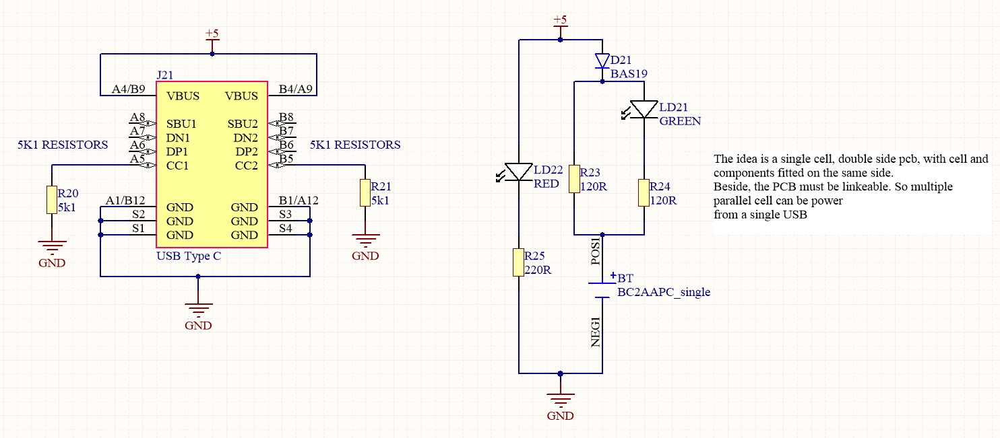
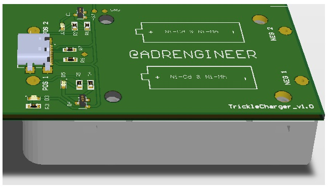

# Trickle charger

### Version 1.0
It is a doble cell design. It uses 0603 components.

### Version 2.0

It is a single cell design, with option for linking cells. Component packages have been changed to 0805 for assembly purposes.  

